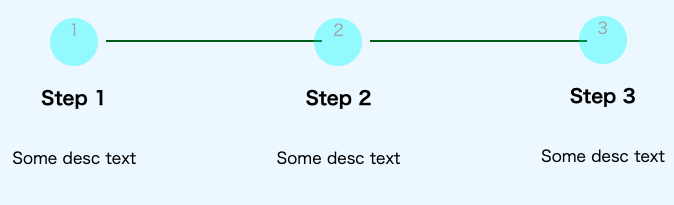

# レスポンシブステップバー

コリス：https://coliss.com/articles/build-websites/operation/css/building-step-components.html

## ノーマルステップバー

ステップの棒と丸の距離を開ける CSS

```CSS
.c-stepper__item:not(:last-child):after {
  width: calc(100% - var(--size) - calc(var(--spacing) * 2));
  left: calc(50% + calc(var(--size) / 2 + var(--spacing)));
}
```

`width:100%`,`left:50%`にすると通常の線でつながっているものになる。線は円の中心から右に伸びている。

### left に関して

- 第 2 項は棒の出発点を円の中心から円の外周へ変更する。`--size`は直径なので 1/2 倍している。
- 第 3 項は円と棒の距離をどれだけ離すかを表す。

### width の説明

left プロパティで線の開始位置をずらした。ずらしたことにより線が隣の棒を突き抜けてしまう。それを解消するために線の長さを短くする。

- 第 2 項で線の長さを円の直径だけ短くする。


_線の長さを円の直径だけ短くした直後_

このままだと少し円に突き刺さってしまう。よってさらに短くする必要がある。

- 第 3 項でさらに線の長さを空けたい余白分だけさらに縮める。右と左でそれぞれ開ける必要があるので 2 倍している。
